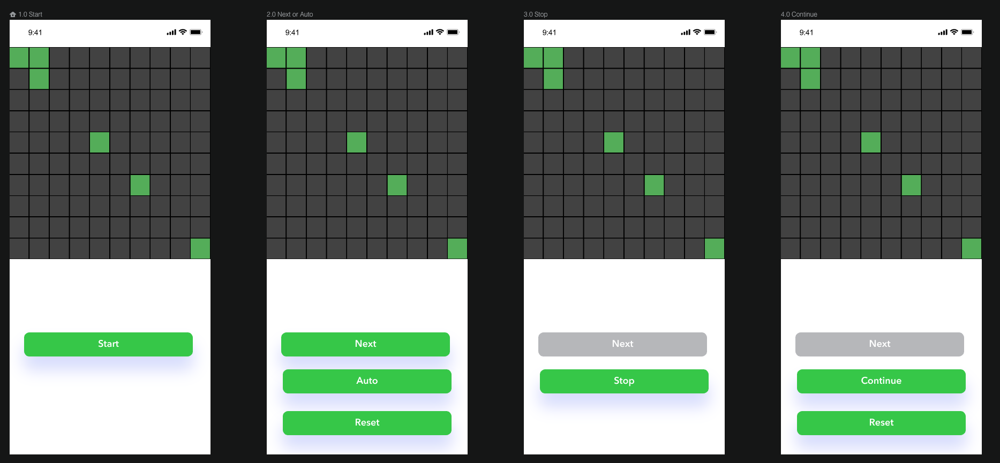

# Kata El Juego de la Vida

Photo by <a href="https://unsplash.com/@acharki95?utm_source=unsplash&amp;utm_medium=referral&amp;utm_content=creditCopyText">Aziz Acharki</a> on <a href="https://unsplash.com/s/photos/life?utm_source=unsplash&amp;utm_medium=referral&amp;utm_content=creditCopyText">Unsplash</a>

## Pre-requisitos
-  React Native
   - Instalar el entorno de desarrollo [**:warning: utiliza la opción React Native CLI Quickstart NO utilizar Expo**](https://reactnative.dev/docs/environment-setup)
- Editor de texto
  - Elegir un editor para codificar, puede ser [Visual Studio Code](https://code.visualstudio.com/), o algúno similar.
  - Agregar la extensión [Prettier](https://marketplace.visualstudio.com/items?itemName=esbenp.prettier-vscode) para mantener un estilo consistente en tu código
  - Instalar [ESLint](https://eslint.org/) para ayudarte a encontrar y arreglar problemas de tu código
  - Agregar la extensión [Eslint](https://marketplace.visualstudio.com/items?itemName=dbaeumer.vscode-eslint) a tu editor para integrar la funcionalidad de Eslint
- Calidad de código. Para analizar la calidad de tu código necesitarás
  - Instalar y configurar [DeepScan](https://deepscan.io/) para analizar tu codigo y mejorar la calidad atendiendo los resultados del análisis
  - Instalar y configurar [CodeClimate](https://codeclimate.com/) para analizar tu codigo y mejorar la calidad atendiendo los resultados del análisis
  
## Requerimientos Funcionales
Addapted from [Coding Dojo](https://codingdojo.org)

The Game of Life is not your typical computer game. It is a 'cellular automaton', and was invented by Cambridge mathematician John Conway.

This game became widely known when it was mentioned in an article published by Scientific American in 1970. It consists of a collection of cells which, based on a few mathematical rules, can live, die or multiply. Depending on the initial conditions, the cells form various patterns throughout the course of the game.

This Kata is about calculating the next generation of Conway’s game of life, given any starting position. 

You start with a two dimensional grid of cells, where each cell is either alive or dead. In this version of the problem, the grid is finite, and no life can exist off the edges. When calcuating the next generation of the grid, follow these rules:

1. Any live cell with fewer than two live neighbours dies, as if caused by underpopulation.
2. Any live cell with more than three live neighbours dies, as if by overcrowding.
3. Any live cell with two or three live neighbours lives on to the next generation.
4. Any dead cell with exactly three live neighbours becomes a live cell.

You should write a program that can accept a grid of cells, and will output a similar grid showing the next generation.

- The dimension of the grid of cells must be 10x10

### Optional
- Make the app work on an grid of cells of an arbitrary dimension.

## Requerimientos no-funcionales
 - Calidad
   - Utilizar un estilo de código estandarizado (revisado por Eslint)
   - Puntuación **Good** obtenida en DeepScan
   - Puntuación **A** obtenida en CodeClimate
- Ejecución 
   - Puede ejecutarse en Android o iOs
- Código fuente
   - Orientado a Objetos
   - Métodos pequeños
   - Aplicar los principios [SOLID](https://blog.usejournal.com/how-to-apply-solid-principles-in-react-applications-6c964091a982)
  
## Diseño
  En la carpeta [img](/img) de este repositorio se encuentra el diseño propuest en formato SVG e [InVision](https://www.invisionapp.com/). Esta es solo una propuesta, pero eres libre de utilizar el diseño que tu quieras siempre y cuando proporcione la misma funcionalidad.

El diseño propuesto tiene:
- Una matriz de 10x10 en la parte superior en donde se muestra la evolución de las celulas
- Un botón para iniciar el juego (start)
- Un botón para avanzar a la siguiente generación o iteración de manera manual (next)
- Un botón para avanzar a las siguientes generaciones o iteraciones de manera automatica (auto)
- Un btón para detener el avance automático (stop)
- Un botón para restablecer el juego a su estado inicial (reset)

## Entregable
- Código fuente en Github
- Incluir en el repositorio la puntuación obtenida (badge) en DeepScan
- Incluir en el repositorio la puntuación obtenida (badge) en CodeClimate
- Documentar en [este archivo](setup/README.md) los pasos necesarios para ejecutar la App
- [Los commits deben se significativos](https://medium.com/better-programming/you-need-meaningful-commit-messages-d869e44e98d4)

## Evaluación
- Cumplimiento de requerimientos funcionales
- Cumplimiento de requerimientos no funcionales
- Implementacón del diseño solicitado

## Setup
[Aquí se describen los pasos necesarios para ejecutar y probar este proyecto](setup/README.md)

## Recursos
[Para apoyo de tus actividades utiliza esta lista de recursos recomendados](https://github.com/bright-coders/commons/tree/master/topics/resources-react-native)
  

